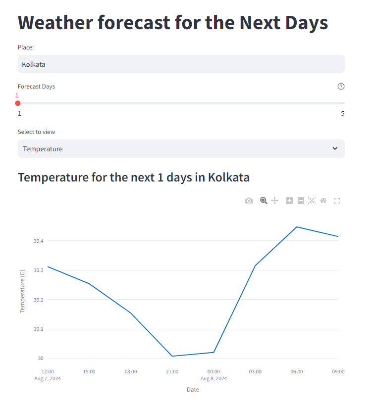
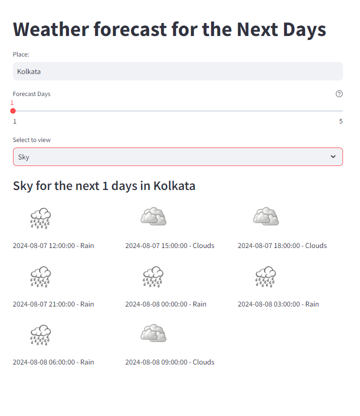

# 🌦️ Weather Forecast App

This Streamlit app provides a weather forecast for the next days. You can input a place, select the number of forecast days (up to 5), and choose to view either temperature or sky conditions. The data is fetched from the [OpenWeatherMap API](https://openweathermap.org/).

## 🚀 How to Use

1. **Input Place**: Enter the name of the place for which you want to see the weather forecast.
2. **Select Days**: Use the slider to select the number of forecast days (1 to 5).
3. **Choose Option**: Choose to view either "Temperature" or "Sky" conditions.
4. **View Results**: The app will display a line chart for temperature or images for sky conditions along with the date and time.

## 🛠️ Installation

1. Clone the repository:
    ```bash
    git clone https://github.com/anindyaPrivate/Weather-Forecast-APP.git
    ```
2. Navigate to the project directory:
    ```bash
    cd weather-forecast-app
    ```
3. Run the Streamlit app:
    ```bash
    streamlit run app.py
    ```

## 🔑 API Key

To use the OpenWeatherMap API, you need an API key. Follow these steps to get one:

1. Go to [OpenWeatherMap](https://openweathermap.org/) and sign up for an account.
2. Navigate to the API section and generate an API key.
3. Add your API key to the `Backend.py` file in the appropriate place:
    ```python
    api_key = "your_api_key_here"
    ```

## 📋 Note

- This API works for a maximum of 5 days of forecast.

## 🌐 OpenWeatherMap

For more information about the API and its capabilities, visit the [OpenWeatherMap website](https://openweathermap.org/).

## 🖼️ Screenshots





## 🎥 Demo Video

Watch the demo video to see how the Weather Forecast App works:

[Download Demo Video](video/video.mp4)


<video width="600" controls>
  <source src="video/video.mp4" type="video/mp4">
  Your browser does not support the video tag.
</video>

---

Feel free to contribute and enhance the app! 😊
